# 数据集说明  
## CSV数据包含变量
### 1. TIME 时间  
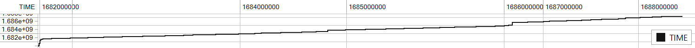
int类型，10秒为间隔，单位s，时间戳格式
### 2. CHARGE_STATUS 充电阶段

int类型，标签值，取值分为1，3，4四种  
1:电池充电状态  
3:电池放电状态  
4:电池充电结束状态  
### 3. SPEED 行驶速度  
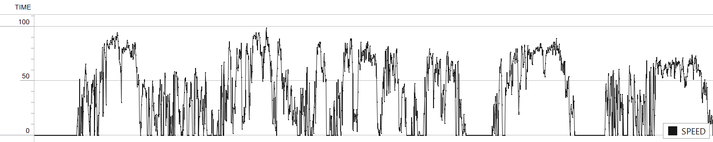
float类型，车辆行驶速度，单位km/h
### 4. SUM_MILE 总里程数  
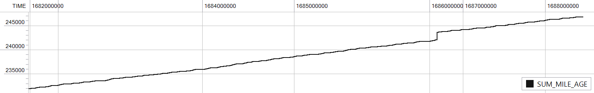
float类型，车辆总里程数，单位英里  
### 5. SUM_VOLTAGE 电池总电压值  
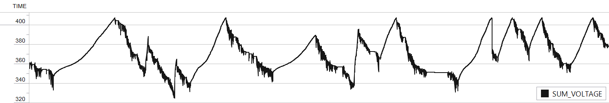
float类型，电池总电压（由电芯组串联成），单位V伏特  
### 6. SUM_CURRENT 电池总电流值  
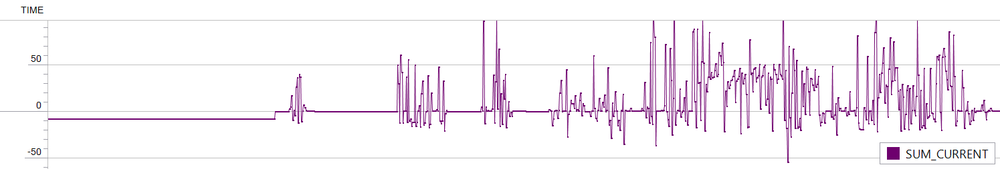
float类型，电池放电电流，充电情况下为负值，单位A安培  
### 7. SOC state of charge 荷电状态  

int类型，电池荷电状态，表示电池剩余电量的百分比，单位%  
### 8. MAX_VOLT_CELL_ID / MAX_CELL_VOLT 最大电压电芯编号及其电压值  
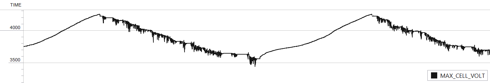
均为int类型，显示电芯组中电压最大的电芯数据，编号依电池类型而定，有95电芯和96电芯两种电池系统结构，编号从0开始，电压值单位mV毫伏  
### 9. MIN_VOLT_CELL_ID / MIN_CELL_VOLT 最小电压电芯编号及其电压值 
同8, 显示电芯组中电压最小的电芯数据
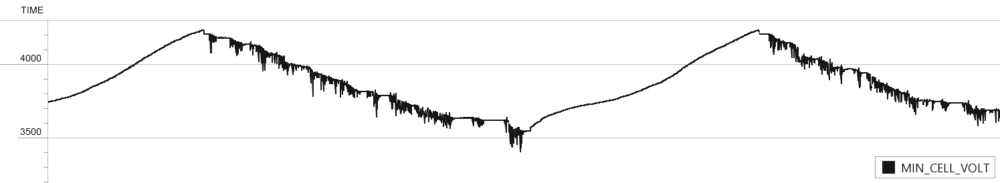
### 10. MAX_TEMP_PROBE_ID / MAX_TEMP 最大温度探针编号及其温度值  
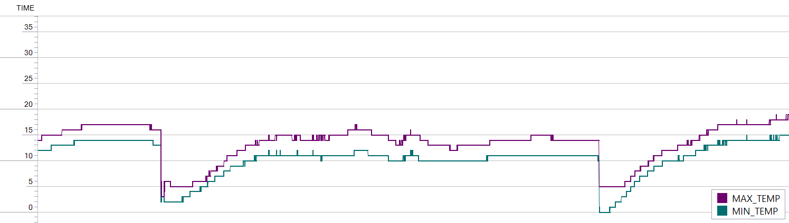
均为int类型，显示温度探针中温度最大的探针数据，编号依电池类型而定，有34探针和32探针两种结构，编号从0开始，温度值单位℃摄氏度
### 11. MIN_TEMP_PROBE_ID / MIN_TEMP 最小温度探针编号及其温度值 
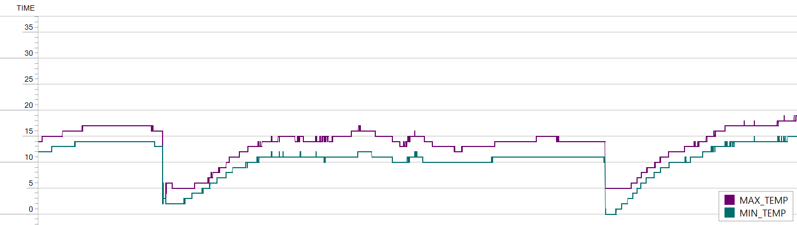 
同10，显示温度探针中温度最小的探针数据
### 12. U-xxx 所有电芯的电压值
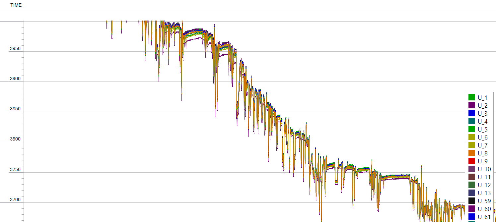
均为int类型，具体数量取决于电池结构，单位mV毫伏
### 13. T-xxx 所有温度探针的温度值
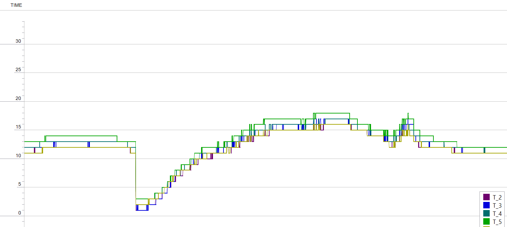
均为int类型，具体数量取决于电池结构，单位℃摄氏度  
## 题目需求  
需开发基于Transformer/GNN/多模态融合等大模型架构的预警算法，支持时序数据分析，处理电压/电流/温度等多维度传感器数据，**预测电池安全风险**，**定位故障模式**（如内短路等）。  
  
需**自行构建包含正常工况与典型故障模式的电池数据集**，完成**算法模型训练**。要求算法需要具备跨电芯体系泛化预警能力，并在发榜单位提供实车脱敏数据集上进行**预警能力验证**，算法需依据实车数据准确辨识出故障车辆。  

还需要完成**动力电池健康度评估算法开发**，算法应当基于电池可用容量、电压一致性、内阻一致性、温度一致性等**典型电池状态特征**开展电池健康状态多维度评估。并基于发榜单位提供的实车脱敏数据开展算法评估能力验证，算法需准确评估出特定车辆数据的**电池健康度**。